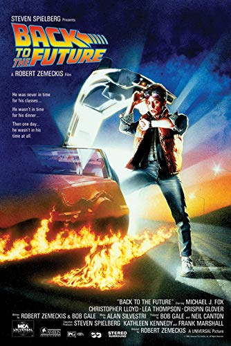

> https://maximlopez.github.io/frontend-AllezCine/
# frontend-AllezCine
<p></p>

---

# Lien des consoles
[Consignes](https://github.com/becodeorg/CRL-Turing-3.11/tree/master/Projets/AllezCine)

## Objectifs
* Respecter un design fourni.
* Consolider les acquis en git, HTML, CSS et Bootstrap.
* Utiliser javascript et jQuery dans un projet réaliste.
* Avoir un nouveau projet à ajouter à son portfolio.

---

# Les langages et outils utilisés 
* HTML 5
* CSS3
* JavaScript
* Markdown
* Git
* BootStrap
* Responsive Design
* Font Awesome Icons

---

# Qui sont les auteurs ? 
<p>Ce projet a été réalisé par :</p>

* [Maud Barbier](https://github.com/maudbecode)
* [Ludovic Lambinon](https://github.com/ludoviclambinon)
* [Maxim Lopez](https://github.com/MaximLopez)
* [Sébastien Parmentier](https://github.com/ParmentierS)

<p>Alors en formation chez BeCode</p>

## Quand a t-il été réalisé ? 

Ce projet a été réalisé le 29 avril 2019.

## Dans quel cadre ce projet a vu le jour ? 
Il s'agit d'un travail de groupe réalisé dans le cadre de la formation BeCode.

--- 

# Voir le projet ?
Il est possible de voir le projet grâce à GitHub Pages.
.


## À quel stade est le projet ? 
Le projet est en cours de réalisation. Il reste une phase de debug car le site présente quelques problèmes.


# Comment récupérer le projet
Il suffit de cloner le dépôt ou de télécharger le zip de ce dernier. Il est également possible de le voir en [ligne](https://maximlopez.github.io/frontend-AllezCine/).

# Présentation du code 
<p>Dans cette partie, vous allez pouvoir découvrir le code qui a été utilisé pour le projet</p>
<details>
    <summary>Partie 1 : HTML</summary>

    ```

<head>
    <meta charset="UTF-8">
    <meta name="viewport" content="width=device-width, initial-scale=1.0">
    <meta http-equiv="X-UA-Compatible" content="ie=edge">
    <!--Favicon-->
    <link rel="shortcut icon" href="assets/img/favicon.png" type="image/png">
    <!--BootStrap-->
    <link rel="stylesheet" href="https://stackpath.bootstrapcdn.com/bootstrap/4.3.1/css/bootstrap.min.css"
        integrity="sha384-ggOyR0iXCbMQv3Xipma34MD+dH/1fQ784/j6cY/iJTQUOhcWr7x9JvoRxT2MZw1T" crossorigin="anonymous">
    <script src="https://stackpath.bootstrapcdn.com/bootstrap/4.3.1/js/bootstrap.min.js"
        integrity="sha384-JjSmVgyd0p3pXB1rRibZUAYoIIy6OrQ6VrjIEaFf/nJGzIxFDsf4x0xIM+B07jRM" crossorigin="anonymous">
    </script>
    <script src="https://code.jquery.com/jquery-3.3.1.slim.min.js"
        integrity="sha384-q8i/X+965DzO0rT7abK41JStQIAqVgRVzpbzo5smXKp4YfRvH+8abtTE1Pi6jizo" crossorigin="anonymous">
    </script>
    <script src="https://cdnjs.cloudflare.com/ajax/libs/popper.js/1.14.7/umd/popper.min.js"
        integrity="sha384-UO2eT0CpHqdSJQ6hJty5KVphtPhzWj9WO1clHTMGa3JDZwrnQq4sF86dIHNDz0W1" crossorigin="anonymous">
    </script>
    <script src="https://code.jquery.com/jquery-3.2.1.slim.min.js"
        integrity="sha384-KJ3o2DKtIkvYIK3UENzmM7KCkRr/rE9/Qpg6aAZGJwFDMVNA/GpGFF93hXpG5KkN" crossorigin="anonymous">
    </script>
    <script src="https://cdnjs.cloudflare.com/ajax/libs/popper.js/1.12.9/umd/popper.min.js"
        integrity="sha384-ApNbgh9B+Y1QKtv3Rn7W3mgPxhU9K/ScQsAP7hUibX39j7fakFPskvXusvfa0b4Q" crossorigin="anonymous">
    </script>
    <script src="https://maxcdn.bootstrapcdn.com/bootstrap/4.0.0/js/bootstrap.min.js"
        integrity="sha384-JZR6Spejh4U02d8jOt6vLEHfe/JQGiRRSQQxSfFWpi1MquVdAyjUar5+76PVCmYl" crossorigin="anonymous">
    </script>
    <!--Google Fonts-->
    <link href="https://fonts.googleapis.com/css?family=PT+Sans&display=swap" rel="stylesheet">
    <link href="https://fonts.googleapis.com/css?family=Montserrat&display=swap" rel="stylesheet">
    <!--Font Awesome-->
    <link rel="stylesheet" href="https://use.fontawesome.com/releases/v5.8.2/css/all.css"
        integrity="sha384-oS3vJWv+0UjzBfQzYUhtDYW+Pj2yciDJxpsK1OYPAYjqT085Qq/1cq5FLXAZQ7Ay" crossorigin="anonymous">
    <!--CSS-->
    <link rel="stylesheet" type="text/css" href="assets/css/style.min.css">
    <link rel="stylesheet" type="text/css" href="assets/css/footer.min.css">
    <!--FAVICON-->
    <link rel="shortcut icon" href="assets/img/favicon.png" type="image/png">
    <!--TITLE_PAGE-->
    <title>Accueil</title>
    <!--MAUD FILES-->
    <link rel="stylesheet" href="assets/css/connect.css">
    <link rel="stylesheet" href="assets/css/modal.min.css">
</head>

<body>
    <!--AGE_RESTRICTION-->
    <div class="modal2 ageBox" id="ageBox">
        <div class="modal-age">
            <h1 class="title">Avez-vous plus de 18 ans ?</h1>
        </div>
        <div class="btt">
            <button class="myBtn accept yes" id="yes"><i class="far fa-check-circle"></i> Oui</button>
            <button class="myBtn refuse no" id="no"><i class="fas fa-times-circle"></i> Non</button>
        </div>
    </div>
    <!--FIN_AGE_RESTRICTION-->
    <header>
        <!--NAVBAR-->
        <nav class="navBar navbar navbar-expand-lg navbar-custom bg-custom">
            <div class="container">
                <!--TITRE ALLEZCINE!-->
                <a class="navbar-brand" href="#"><span class="titreAllez">ALLEZ</span>CINE!</a>
                <button class="navbar-toggler" type="button" data-toggle="collapse"
                    data-target="#navbarSupportedContent" aria-controls="navbarSupportedContent" aria-expanded="false"
                    aria-label="Toggle navigation">
                    <span class="navbar-toggler-icon"><i class="hamburgerIcon fas fa-bars"></i></span>
                </button>
                <div class="collapse navbar-collapse" id="navbarSupportedContent">
                    <ul class="navbar-nav mr-auto">
                        <li class="nav-item active">
                            <!--TITRES NAVBAR-->
                            <a class="nav-link" href="#"><span class="titreHome">Home</span> <span
                                    class="sr-only">(current)</span></a>
                        </li>
                        <li class="nav-item dropdown">
                            <a class="nav-link dropdown-toggle" href="#" id="navbarDropdown" role="button"
                                data-toggle="dropdown" aria-haspopup="true" aria-expanded="false">
                                Genre
                            </a>
                            <div class="dropdown-menu" aria-labelledby="navbarDropdown">
                                <a class="dropdown-item" href="#">Action</a>
                                <a class="dropdown-item" href="#">Comédie</a>
                                <a class="dropdown-item" href="#">Horreur</a>
                            </div>
                        </li>
                        <li class="nav-item dropdown">
                            <a class="nav-link dropdown-toggle" href="#" id="navbarDropdown" role="button"
                                data-toggle="dropdown" aria-haspopup="true" aria-expanded="false">
                                Année
                            </a>
                            <div class="dropdown-menu" aria-labelledby="navbarDropdown">
                                <a class="dropdown-item" href="#">2000 - 2010</a>
                                <a class="dropdown-item" href="#">1980 - 1990</a>
                                <a class="dropdown-item" href="#">1960 - 1970</a>
                            </div>
                        </li>
                    </ul>
                    <div class="container h-100">
                        <div class="d-flex justify-content-center h-100">
                            <div class="searchbar">
                                <input class="search_input" type="text" name="" placeholder="Rechercher">
                                <a href="#" class="search_icon"><i class="fas fa-search"></i></a>
                            </div>
                        </div>
                    </div>
                    <li class="link-nav nav-item">
                        <a class="nav-link" href="#"><span class="titreLink">Contact</span></a>
                    </li>
                </div>
            </div>
        </nav>
        <div id="carouselExampleIndicators" class="my-carousel carousel slide" data-ride="carousel">
            <ol class="carousel-indicators">
                <li data-target="#carouselExampleIndicators" data-slide-to="0" class="active" id="carouselIndicators">
                </li>
                <li data-target="#carouselExampleIndicators" data-slide-to="1" id="carouselIndicators"></li>
                <li data-target="#carouselExampleIndicators" data-slide-to="2" id="carouselIndicators"></li>
            </ol>
            <!--CAROUSEL-->
            <div class="carousel-inner">
                <div class="carousel-item active">
                    
                    <div class="carousel-caption d-none d-md-block">
                        <h2 class="titreLMO">LATEST <span class="lettreLMO">MO</span>VIES <span
                                class="lettreLMO">ON</span>LINE</h2>
                        <p class="descriptifFilm">Drive, mieux que Fast & Furious</p>
                        <p class="logoTrailer"><a class="movieLink" href="https://www.youtube.com/watch?v=KBiOF3y1W0Y"
                                rel="nofollow" target="_blank">Regarder le trailer</a></p>
                    </div>
                </div>
                <div class="carousel-item">
                    
                    <div class="carousel-caption d-none d-md-block">
                        <h2 class="titreLMO">LATEST <span class="lettreLMO">MO</span>VIES <span
                                class="lettreLMO">ON</span>LINE</h2>
                        <p class="descriptifFilm">Commandant Shepard Hazard, au rapport !</p>
                        <p class="logoTrailer"><a class="movieLink" href="https://www.youtube.com/watch?v=YwIt5wagRsg"
                                rel="nofollow" target="_blank">Regarder le trailer</a></p>
                    </div>
                </div>
                <div class="carousel-item">
                    
                    <div class="carousel-caption d-none d-md-block">
                        <h2 class="titreLMO">LATEST <span class="lettreLMO">MO</span>VIES <span
                                class="lettreLMO">ON</span>LINE</h2>
                        <p class="descriptifFilm">Justicier tisseur de toiles</p>
                        <p class="logoTrailer"><a class="movieLink" href="https://www.youtube.com/watch?v=TYMMOjBUPMM"
                                rel="nofollow" target="_blank">Regarder le trailer</a></p>
                    </div>
                </div>
            </div>
        </div>
        <!--NAVBAR BAS-->
        <ul class="bottomNav nav nav-pills">
            <li class="nav-item">
                <a class="nav-link" href="#"><i class="fas fa-phone"></i> <span
                        class="phoneNav">+1-202-555-0116</span></a>
            </li>
            <li class="nav-item">
                <button type="button" class="black-button btn btn-dark">Login</button>
            </li>
            <li class="nav-item">
                <button type="button" class="black-button btn btn-dark">S'enregistrer</button>
            </li>
        </ul>
    </header>
    <!--NAVBAR END-->
    <!--SideBar buttons-->
    <div id="mySidenav" class="sidenav">
        <a href="#" id="facebook">Facebook <i class="fab fa-facebook-f"></i></a>
        <a href="#" id="twitter">Twitter <i class="fab fa-twitter"></i></a>
        <a href="#" id="googlePlus">Google+ <i class="fab fa-google-plus-g"></i></a>
    </div>
    <!-- MAIN-FAVORITE -->
    <main>
        <div class="container" id="favoriteContainer">
            <div class="row" id="favoriteRow">
                <div class="col-md-2 offset-md-1">
                    <div class="card-group" id="favoriteCard">
                        <div class="card text-center">
                            
                            <div class="card-body">
                                <h5 class="card-title" id="titleFilm">Shutter Island</h5>
                            </div>
                            <div class="card-body">
                                <div class="row">
                                    <p class="card-text col-md-5"><small class="text">2010</small></p>
                                    <p class="card-text col-md-7"><small class="text"><strong>Thriller</strong></small>
                                    </p>
                                </div>
                            </div>
                        </div>
                    </div>
                </div>
                <div class="col-md-2">
                    <div class="card-group">
                        <div class="card text-center">
                            
                            <div class="card-body">
                                <h5 class="card-title" id="titleFilm">Intouchables</h5>
                            </div>
                            <div class="card-body">
                                <div class="row">
                                    <p class="card-text col-md-5"><small class="text">2011</small></p>
                                    <p class="card-text col-md-7"><small class="text"><strong>Comédie</strong></small>
                                    </p>
                                </div>
                            </div>
                        </div>
                    </div>
                </div>
                <div class="col-md-2">
                    <div class="card-group">
                        <div class="card text-center">
                            
                            <div class="card-body">
                                <h5 class="card-title" id="titleFilm">Inception</h5>
                            </div>
                            <div class="card-body">
                                <div class="row">
                                    <p class="card-text col-md-5"><small class="text">2010</small></p>
                                    <p class="card-text col-md-7"><small
                                            class="text"><strong>Science-fiction</strong></small></p>
                                </div>
                            </div>
                        </div>
                    </div>
                </div>
                <div class="col-md-2">
                    <div class="card-group">
                        <div class="card text-center">
                            
                            <div class="card-body">
                                <h5 class="card-title" id="titleFilm">The Fall</h5>
                            </div>
                            <div class="card-body">
                                <div class="row">
                                    <p class="card-text col-md-5"><small class="text">2006</small></p>
                                    <p class="card-text col-md-7"><small class="text"><strong>Drame</strong></small></p>
                                </div>
                            </div>
                        </div>
                    </div>
                </div>
                <div class="col-md-2">
                    <div class="card-group">
                        <div class="card text-center">
                            
                            <div class="card-body">
                                <h5 class="card-title" id="titleFilm">Zoolander</h5>
                            </div>
                            <div class="card-body">
                                <div class="row">
                                    <p class="card-text col-md-5"><small class="text">2001</small></p>
                                    <p class="card-text col-md-7"><small class="text"><strong>Comédie</strong></small>
                                    </p>
                                </div>
                            </div>
                        </div>
                    </div>
                </div>
            </div>
        </div>
        <!--FIN_FAVORITE-->
        <!--FAVORITE_FILMS-->
        <div class="container favoritesFilms">
            <div class="row featMovies">
                <h2>FEATURED MOVIES</h2>
            </div>
            <div class="row menuFeatMovies container" id="moviesContainer">
                <div class="col-md-11 offset-md-1">
                    <ul class="nav nav-pills">
                        <li class="nav-item">
                            <a class="nav-link active" id="boutonActif" href="#moviesContainer">Tous</a>
                        </li>
                        <li class="nav-item dropdown">
                            <a class="nav-link dropdown-toggle" id="boutonNonActif" data-toggle="dropdown" href="#"
                                role="button" aria-haspopup="true" aria-expanded="false">Genre</a>
                            <div class="dropdown-menu">
                                <a class="dropdown-item filter" id="action" href="#moviesContainer">Action</a>
                                <a class="dropdown-item filter" id="scifi" href="#moviesContainer">Sci-fi</a>
                                <a class="dropdown-item filter" id="comedie" href="#moviesContainer">Comédie</a>
                                <a class="dropdown-item filter" id="thriller" href="#moviesContainer">Thriller</a>
                                <a class="dropdown-item filter" id="dramatique" href="#moviesContainer">Dramatique</a>
                                <a class="dropdown-item filter" id="aventure" href="#moviesContainer">Aventure</a>
                            </div>
                        </li>
                        <li class="nav-item dropdown">
                            <a class="nav-link dropdown-toggle" id="boutonNonActif" data-toggle="dropdown" href="#"
                                role="button" aria-haspopup="true" aria-expanded="false">Année</a>
                            <div class="dropdown-menu">
                                <a class="dropdown-item filterYear" id="1980" href="#moviesContainer">1980 - 1990</a>
                                <a class="dropdown-item filterYear" id="1990" href="#moviesContainer">1990 - 2000</a>
                                <a class="dropdown-item filterYear" id="2000" href="#moviesContainer">2000 - 2010</a>
                                <a class="dropdown-item filterYear" id="2010" href="#moviesContainer">2010 - 2020</a>
                            </div>
                        </li>
                    </ul>
                </div>
                <!--LISTING-FAVORITE_SERIES-->
                <div class="container" id="featured-movies">
                    <div class="row">
                        <div class="col-md-12">
                            <!--PREMIERE LIGNE-->
                            <div class="row">
                                <div class="col-md-2">
                                    <div class="card-group">
                                        <div id="trailer" class="card text-center">
                                            <div class="imgContainer">
                                                
                                            </div>
                                            <div class="card-body">
                                                <h5 class="card-title">What we do in the Shadows</h5>
                                                <p class="card-text col-md-12"><small class="text">2014</small></p>
                                            </div>
                                        </div>
                                    </div>
                                </div>
                                <div class="col-md-2">
                                    <div class="card-group">
                                        <div id="trailer" class="card text-center">
                                            <div class="imgContainer">
                                                
                                            </div>
                                            <div class="card-body">
                                                <h5 class="card-title">Terminator 2</h5>
                                                <p class="card-text col-md-12"><small class="text">1991</small></p>
                                            </div>
                                        </div>
                                    </div>
                                </div>
                                <div class="col-md-2">
                                    <div class="card-group">
                                        <div id="trailer" class="card text-center">
                                            <div class="imgContainer">
                                                
                                            </div>
                                            <div class="card-body">
                                                <h5 class="card-title">Rambo : First Blood</h5>
                                                <p class="card-text col-md-12"><small class="text">1982</small></p>
                                            </div>
                                        </div>
                                    </div>
                                </div>
                                <div class="col-md-2">
                                    <div class="card-group">
                                        <div id="trailer" class="card text-center">
                                            <div class="imgContainer">
                                                
                                            </div>
                                            <div class="card-body">
                                                <h5 class="card-title">Gremlins</h5>
                                                <p class="card-text col-md-12"><small class="text">1984</small></p>
                                            </div>
                                        </div>
                                    </div>
                                </div>
                                <div class="col-md-2">
                                    <div class="card-group">
                                        <div id="trailer" class="card text-center">
                                            <div class="imgContainer">
                                                
                                            </div>
                                            <div class="card-body">
                                                <h5 class="card-title">Retour vers le futur</h5>
                                                <p class="card-text col-md-12"><small class="text">1985</small></p>
                                            </div>
                                        </div>
                                    </div>
                                </div>
                                <div class="col-md-2">
                                    <div class="card-group">
                                        <div id="trailer" class="card text-center">
                                            <div class="imgContainer">
                                                
                                            </div>
                                            <div class="card-body">
                                                <h5 class="card-title">Blade Runner</h5>
                                                <p class="card-text col-md-12"><small class="text">1982</small></p>
                                            </div>
                                        </div>
                                    </div>
                                </div>
                                <!--Deuxième ligne // pas besoin de faire une autre rangée -->
                                <div class="col-md-2">
                                    <div class="card-group">
                                        <div id="trailer" class="card text-center">
                                            <div class="containerImg">
                                                
                                            </div>
                                            <div class="card-body">
                                                <h5 class="card-title">The Mask</h5>
                                                <p class="card-text col-md-12"><small class="text">1994</small></p>
                                            </div>
                                        </div>
                                    </div>
                                </div>
                                <div class="col-md-2">
                                    <div class="card-group">
                                        <div id="trailer" class="card text-center">
                                            <div class="imgContainer">
                                                
                                            </div>
                                            <div class="card-body">
                                                <h5 class="card-title">Last Action Hero</h5>
                                                <p class="card-text col-md-12"><small class="text">1993</small></p>
                                            </div>
                                        </div>
                                    </div>
                                </div>
                                <div class="col-md-2">
                                    <div class="card-group">
                                        <div id="chtitrailer" class="card text-center">
                                            <div class="imgContainer">
                                                
                                            </div>
                                            <div class="card-body">
                                                <h5 class="card-title">Die Hard : Piège de Cristal</h5>
                                                <p class="card-text col-md-12"><small class="text">1988</small></p>
                                            </div>
                                        </div>
                                    </div>
                                </div>
                                <div class="col-md-2">
                                    <div class="card-group">
                                        <div id="trailer" class="card text-center">
                                            <div class="imgContainer">
                                                
                                            </div>
                                            <div class="card-body">
                                                <h5 class="card-title">Predator</h5>
                                                <p class="card-text col-md-12"><small class="text">1987</small></p>
                                            </div>
                                        </div>
                                    </div>
                                </div>
                                <div class="col-md-2">
                                    <div class="card-group">
                                        <div id="trailer" class="card text-center">
                                            <div class="imgContainer">
                                                
                                            </div>
                                            <div class="card-body">
                                                <h5 class="card-title">Men in Black</h5>
                                                <p class="card-text col-md-12"><small class="text">1997</small></p>
                                            </div>
                                        </div>
                                    </div>
                                </div>
                                <div class="col-md-2">
                                    <div class="card-group">
                                        <div id="trailer" class="card text-center">
                                            <div class="imgContainer">
                                                
                                            </div>
                                            <div class="card-body">
                                                <h5 class="card-title">Il faut sauver le soldat Ryan</h5>
                                                <p class="card-text col-md-12"><small class="text">1998</small></p>
                                            </div>
                                        </div>
                                    </div>
                                </div>
                            </div>
                        </div>
                    </div>
                    <!--BOUTON-VOIR_PLUS-->
                    <button type="button" class="btn btn-danger" id="plusDeFilms">Plus de Films</button>
                    <button type="button" class="btn btn-danger" id="moinsDeFilms">Moins de films</button>
                    <!--FIN_LISTING-FAVORITE_SERIES-->
                </div>
            </div>
            <!--FIN-FAVORITE_FILMS-->
            <!--FAVORITE_SERIES_TV-->
            <div class="row featMovies container-fluid">
                <h2>FEATURED SERIES TV</h2>
            </div>
            <div class="row menuFeatMovies container" id="seriesContainer">
                <div class="col-md-11 offset-md-1">
                    <ul class="nav nav-pills">
                        <li class="nav-item">
                            <a class="nav-link active" id="boutonActif">Tous</a>
                        </li>
                        <li class="nav-item dropdown">
                            <a class="nav-link dropdown-toggle" id="boutonNonActif" data-toggle="dropdown" href="#"
                                role="button" aria-haspopup="true" aria-expanded="false">Genre</a>
                            <div class="dropdown-menu">
                                <a class="dropdown-item" href="#">Action</a>
                                <a class="dropdown-item" href="#">Sci-fi</a>
                                <a class="dropdown-item" href="#">Comédie</a>
                                <a class="dropdown-item" href="#">Thriller</a>
                                <a class="dropdown-item" href="#">Dramatique</a>
                                <a class="dropdown-item" href="#">Aventure</a>
                            </div>
                        </li>
                        <li class="nav-item dropdown">
                            <a class="nav-link dropdown-toggle" id="boutonNonActif" data-toggle="dropdown" href="#"
                                role="button" aria-haspopup="true" aria-expanded="false">Année</a>
                            <div class="dropdown-menu">
                                <a class="dropdown-item" href="#">1980 - 1990</a>
                                <a class="dropdown-item" href="#">1990 - 2000</a>
                                <a class="dropdown-item" href="#">2000 - 2010</a>
                                <a class="dropdown-item" href="#">2010 - 2020</a>
                            </div>
                        </li>
                    </ul>
                </div>
            </div>
            <!--FIN-FAVORITE_SERIES-->
            <!--LISTING-FAVORITE_SERIES-->
            <div class="container-fluid" id="featured-series">
                <div class="row">
                    <div class="col-md-12">
                        <!--PREMIERE LIGNE-->
                        <div class="row">
                            <div class="col-md-2">
                                <div class="card-group">
                                    <div id="trailer" class="card text-center">
                                        <div class="imgContainer">
                                            
                                        </div>
                                        <div class="card-body">
                                            <h5 class="card-title">Six Feet Under</h5>
                                            <p class="card-text col-md-12"><small class="text">2001</small></p>
                                        </div>
                                    </div>
                                </div>
                            </div>
                            <div class="col-md-2">
                                <div class="card-group">
                                    <div id="trailer" class="card text-center">
                                        <div class="imgContainer">
                                            
                                        </div>
                                        <div class="card-body">
                                            <h5 class="card-title">Stranger Things</h5>
                                            <p class="card-text col-md-12"><small class="text">2001</small></p>
                                        </div>
                                    </div>
                                </div>
                            </div>
                            <div class="col-md-2">
                                <div class="card-group">
                                    <div id="trailer" class="card text-center">
                                        <div class="imgContainer">
                                            
                                        </div>
                                        <div class="card-body">
                                            <h5 class="card-title">Lost</h5>
                                            <p class="card-text col-md-12"><small class="text">2004</small></p>
                                        </div>
                                    </div>
                                </div>
                            </div>
                            <div class="col-md-2">
                                <div class="card-group">
                                    <div id="trailer" class="card text-center">
                                        <div class="imgContainer">
                                            
                                        </div>
                                        <div class="card-body">
                                            <h5 class="card-title">Better Call Saul</h5>
                                            <p class="card-text col-md-12"><small class="text">2015</small></p>
                                        </div>
                                    </div>
                                </div>
                            </div>
                            <div class="col-md-2">
                                <div class="card-group">
                                    <div id="trailer" class="card text-center">
                                        <div class="imgContainer">
                                            
                                        </div>
                                        <div class="card-body">
                                            <h5 class="card-title">Prince de Bel-Air, Le</h5>
                                            <p class="card-text col-md-12"><small class="text">1990</small></p>
                                        </div>
                                    </div>
                                </div>
                            </div>
                            <div class="col-md-2">
                                <div class="card-group">
                                    <div id="trailer" class="card text-center">
                                        <div class="imgContainer">
                                            
                                        </div>
                                        <div class="card-body">
                                            <h5 class="card-title">The Office (US)</h5>
                                            <p class="card-text col-md-12"><small class="text">2005</small></p>
                                        </div>
                                    </div>
                                </div>
                            </div>
                            <!--Deuxième ligne // pas besoin de faire une autre rangée -->
                            <div class="col-md-2">
                                <div class="card-group">
                                    <div id="trailer" class="card text-center">
                                        <div class="containerImg">
                                            
                                        </div>
                                        <div class="card-body">
                                            <h5 class="card-title">Brooklyn Nine-Nine</h5>
                                            <p class="card-text col-md-12"><small class="text">2013</small></p>
                                        </div>
                                    </div>
                                </div>
                            </div>
                            <div class="col-md-2">
                                <div class="card-group">
                                    <div id="trailer" class="card text-center">
                                        <div class="imgContainer">
                                            
                                        </div>
                                        <div class="card-body">
                                            <h5 class="card-title">Modern Family</h5>
                                            <p class="card-text col-md-12"><small class="text">2009</small></p>
                                        </div>
                                    </div>
                                </div>
                            </div>
                            <div class="col-md-2">
                                <div class="card-group">
                                    <div id="chtitrailer" class="card text-center">
                                        <div class="imgContainer">
                                            
                                        </div>
                                        <div class="card-body">
                                            <h5 class="card-title">X-Files</h5>
                                            <p class="card-text col-md-12"><small class="text">1993</small></p>
                                        </div>
                                    </div>
                                </div>
                            </div>
                            <div class="col-md-2">
                                <div class="card-group">
                                    <div id="trailer" class="card text-center">
                                        <div class="imgContainer">
                                            
                                        </div>
                                        <div class="card-body">
                                            <h5 class="card-title">Friends</h5>
                                            <p class="card-text col-md-12"><small class="text">1994</small></p>
                                        </div>
                                    </div>
                                </div>
                            </div>
                            <div class="col-md-2">
                                <div class="card-group">
                                    <div id="trailer" class="card text-center">
                                        <div class="imgContainer">
                                            
                                        </div>
                                        <div class="card-body">
                                            <h5 class="card-title">Black Mirror</h5>
                                            <p class="card-text col-md-12"><small class="text">2011</small></p>
                                        </div>
                                    </div>
                                </div>
                            </div>
                            <div class="col-md-2">
                                <div class="card-group">
                                    <div id="trailer" class="card text-center">
                                        <div class="imgContainer">
                                            
                                        </div>
                                        <div class="card-body">
                                            <h5 class="card-title">Malcolm</h5>
                                            <p class="card-text col-md-12"><small class="text">2000</small></p>
                                        </div>
                                    </div>
                                </div>
                            </div>
                        </div>
                    </div>
                </div>
                <!--BOUTON-VOIR_PLUS-->
                <button type="button" class="btn btn-danger" id="plusDeFilms">Plus de Films</button>
                <button type="button" class="btn btn-danger" id="moinsDeFilms">Moins de films</button>
                <!--FIN_LISTING-FAVORITE_SERIES-->
            </div>
        </div>
        <!-- Shop movies -->
        <div class="container">
            <div class="row">
                <div class="col-md-12 shopMovies">
                    <h2>SHOP MOVIES</h2>
                </div>
            </div>
        </div>
        <div class="container-fluid">
            <div class="row navigationArrow">
                <div class="col-md-1 offset-md-11">
                    <div class="btn-group" role="group" aria-label="Basic example">
                        <button type="button" class="btn btn-secondary" id="left-scrolling">&#139;</button>
                        <button type="button" class="btn btn-secondary" id="right-scrolling">&#155;</button>
                    </div>
                </div>
            </div>
        </div>
        <!--Listing film-->
        <div class="container-fluid" id="shopMoviesList">
            <div class="row">
                <div class="col-md-6">
                    <div class="row">
                        <div class="col-md-3">
                            <div class="card-group">
                                <div id="trailer" class="card text-center">
                                    <div class="imgContainer">
                                        
                                    </div>
                                    <div class="card-body">
                                        <h5 class="card-title">Titre film</h5>
                                        <p class="card-text col-md-12"><small class="text">2016</small></p>
                                    </div>
                                </div>
                            </div>
                        </div>
                        <div class="col-md-3">
                            <div class="card-group">
                                <div id="trailer" class="card text-center">
                                    <div class="imgContainer">
                                        
                                    </div>
                                    <div class="card-body">
                                        <h5 class="card-title">Titre film</h5>
                                        <p class="card-text col-md-12"><small class="text">2016</small></p>
                                    </div>
                                </div>
                            </div>
                        </div>
                        <div class="col-md-3">
                            <div class="card-group">
                                <div id="trailer" class="card text-center">
                                    <div class="imgContainer">
                                        
                                    </div>
                                    <div class="card-body">
                                        <h5 class="card-title">Titre film</h5>
                                        <p class="card-text col-md-12"><small class="text">Année</small></p>
                                    </div>
                                </div>
                            </div>
                        </div>
                        <div class="col-md-3">
                            <div class="card-group">
                                <div id="trailer" class="card text-center">
                                    <div class="imgContainer">
                                        
                                    </div>
                                    <div class="card-body">
                                        <h5 class="card-title">Titre film</h5>
                                        <p class="card-text col-md-12"><small class="text">2016</small></p>
                                    </div>
                                </div>
                            </div>
                        </div>
                    </div>
                    <div class="row movielistdown">
                        <div class="col-md-3">
                            <div class="card-group">
                                <div id="trailer" class="card text-center">
                                    <div class="containerImg">
                                        
                                    </div>
                                    <div class="card-body">
                                        <h5 class="card-title">Titre film</h5>
                                        <p class="card-text col-md-12"><small class="text">2016</small></p>
                                    </div>
                                </div>
                            </div>
                        </div>
                        <div class="col-md-3">
                            <div class="card-group">
                                <div id="trailer" class="card text-center">
                                    <div class="imgContainer">
                                        
                                    </div>
                                    <div class="card-body">
                                        <h5 class="card-title">Titre film</h5>
                                        <p class="card-text col-md-12"><small class="text">2016</small></p>
                                    </div>
                                </div>
                            </div>
                        </div>
                        <div class="col-md-3">
                            <div class="card-group">
                                <div id="chtitrailer" class="card text-center">
                                    <div class="imgContainer">
                                        
                                    </div>
                                    <div class="card-body">
                                        <h5 class="card-title">Titre film</h5>
                                        <p class="card-text col-md-12"><small class="text">2016</small></p>
                                    </div>
                                </div>
                            </div>
                        </div>
                        <div class="col-md-3">
                            <div class="card-group">
                                <div id="trailer" class="card text-center">
                                    <div class="imgContainer">
                                        
                                    </div>
                                    <div class="card-body">
                                        <h5 class="card-title">Titre film</h5>
                                        <p class="card-text col-md-12"><small class="text">2016</small></p>
                                    </div>
                                </div>
                            </div>
                        </div>
                    </div>
                </div>
                <!--Modal player-->
                <div class="col-md-6 align-self-stretch">
                    <div class="row h-100">
                        <div class="col-md-12">
                            <div class="card-group h-100">
                                <div class="card text-center h-100">
                                    <div class="embed-responsive embed-responsive-16by9" id="videoTrailerContainer">
                                        <iframe id="videoTrailer" width="560" height="315"
                                            src="https://www.youtube.com/watch?v=eZhCwpLL9AM" frameborder="0"
                                            allow="autoplay; encrypted-media" allowfullscreen></iframe>
                                    </div>
                                    <div class="card-body" id="shopMovieDetails">
                                        <h3 class="card-title">Titre film</h3>
                                        <p class="card-text col-md-12"><small class="text">Synopsis</small>
                                        </p>
                                        <p class="card-text col-md-12"><small class="text">Date de sortie</small>
                                        </p>
                                        <p class="card-text col-md-12"><small class="text">Genre</small></p>
                                        <p class="card-text col-md-12"><small class="text">Prix</small></p>
                                    </div>
                                </div>
                            </div>
                        </div>
                    </div>
                </div>
                <!--Fin du modal player-->
            </div>
        </div>
        <!-- Contact US -->
        <div class="container mt-4">
            <h2>CONTACT US</h2>
            <div class="row justify-content-center">
                <form class="card-formulaire bg-white">
                    <div class="card-body">
                        <div class="row">
                            <div class="col-lg-6">
                                <input type="text" class="form-control" placeholder="FIRST NAME">
                            </div>
                            <div class="col-lg-6">
                                <input type="text" class="form-control" placeholder="LAST NAME">
                            </div>
                        </div>
                        <div class="row">
                            <div class="col-lg-6">
                                <label for="exampleFormControlInput1"></label>
                                <input type="email" class="form-control" id="exampleFormControlInput1"
                                    placeholder="EMAIL">
                            </div>
                            <div class="col-lg-6">
                                <label for="exampleFormControlSelect1"></label>
                                <input type="text" class="form-control" placeholder="SUBJECT">
                            </div>
                        </div>
                        <div class="row mt-4">
                            <div class="col-lg-12">
                                <textarea class="form-control" id="exampleFormControlTextarea1" rows="3"
                                    placeholder="YOUR MESSAGE"></textarea>
                            </div>
                        </div>
                        <div class="row mt-4">
                            <div class="col-lg-4">
                                <button type="button" class="btn btn-danger" id="buttonSend">SEND
                                    MESSAGE</button>
                            </div>
                        </div>
                    </div>
                </form>
            </div>
        </div>
        </div>
    </main>
    <!-- Footer -->
    <footer>
        <!-- FOOTER - SUBSCRIBE TO US -->
        <div class="jumbotron jumbotron-fluid" id="siteFooter">
            <div class="container">
                <div class="row">
                    <div class="col-md-5 offset-md-3">
                        <p class="footerSubscribe" id="subscribeFooter">SUBSCRIBE TO US</p>
                        <div class="input-group">
                            <input type="text" class="form-control" placeholder="Enter your email..."
                                aria-label="Enter your email..." aria-describedby="basic-addon2">
                            <button type="button" class="btn btn-danger">SUBSCRIBE</button>
                        </div>
                    </div>
                </div>
                <div class="row mt-4">
                    <!-- FOOTER - RELEASE -->
                    <div class="col-2">
                        <span class="titleFooter">RELEASE</span>
                        <div class="col-xs-12">
                            <table class="table">
                                <thead>
                                    <tr>
                                        <td scope="col" id="listeFooter">
                                            <p>2016</p>
                                            <p>2015</p>
                                            <p>2014</p>
                                            <p>2013</p>
                                            <p>2012</p>
                                            <p>2011</p>
                                        </td>
                                    </tr>
                                </thead>
                            </table>
                        </div>
                    </div>
                    <!-- FOOTER - MOVIES -->
                    <div class="col-2">
                        <span class="titleFooter">MOVIES</span>
                        <div class="col-xs-12">
                            <table class="table">
                                <thead>
                                    <tr>
                                        <td scope="col" id="listeFooter">
                                            <p>ADVENTURE</p>
                                            <p>COMEDY</p>
                                            <p>FANTASY</p>
                                            <p>ACTION</p>
                                            <p>MOVIES</p>
                                            <p>HORROR</p>
                                        </td>
                                    </tr>
                                </thead>
                            </table>
                        </div>
                        <!-- FOOTER - REVIEW MOVIES -->
                    </div>
                    <div class="col-2">
                        <span class="titleFooter">REVIEW MOVIES</span>
                        <div class="col-xs-12">
                            <table class="table">
                                <thead>
                                    <tr>
                                        <td scope="col" id="listeFooter">
                                            <p>
                                                <span class="badge badge-secondary">Comedy</span>
                                                <span class="badge badge-secondary">Horror</span>
                                                <span class="badge badge-secondary">Historical</span>
                                                <span class="badge badge-secondary">Romantic</span>
                                                <span class="badge badge-secondary">Love</span>
                                                <span class="badge badge-secondary">Action</span>
                                                <span class="badge badge-secondary">Reviews</span>
                                                <span class="badge badge-secondary">Comedy</span>
                                                <span class="badge badge-secondary">Horror</span>
                                                <span class="badge badge-secondary">Historical</span>
                                                <span class="badge badge-secondary">Romantic</span>
                                                <span class="badge badge-secondary">Love</span>
                                                <span class="badge badge-secondary">Comedy</span>
                                            </p>
                                        </td>
                                    </tr>
                                </thead>
                            </table>
                        </div>
                    </div>
                    <!-- FOOTER - LATEST MOVIES -->
                    <div class="col-3">
                        <span class="titleFooter">LATEST MOVIES</span>
                        <div class="col-xs-12">
                            <table class="table">
                                <thead>
                                    <tr>
                                        <td scope="col">
                                        </td>
                                    </tr>
                                </thead>
                            </table>
                            <div class="row">
                                <div class="col-4"></div>
                                <div class="col-8"></div>
                            </div>
                        </div>
                    </div>
                    <!-- FOOTER - ALLEZCINE! -->
                    <div class="col-3">
                        <span class="motOneFooter">ALLEZ</span>
                        <span class="motTwoFooter">CINE!</span>
                        <div class="col-xs-12">
                            <table class="table">
                                <thead>
                                    <tr>
                                        <td scope="col">
                                        </td>
                                    </tr>
                                </thead>
                            </table>
                            <div class="row">
                                
                                
                                
                                
                                
                                
                            </div>
                        </div>
                    </div>
                </div>
                <!-- FOOTER - SPACE BETWEEN -->
                <div class="row lines">
                    <div class="col-md-12">
                        <table class="table release">
                            <thead>
                                <tr>
                                    <th></th>
                                </tr>
                            </thead>
                        </table>
                    </div>
                </div>
                <!-- FOOTER - CONNECT US -->
                <div class="row justify-content-center">
                    <div class="col" id="connectFooter">
                        <p>CONNECT US</p>
                        <a href="https://www.facebook.com/">
                            <i class="fab fa-facebook-f" class="logoFacebook"></i>
                        </a>
                        <a href="https://twitter.com/?lang=fr">
                            <i class="fab fa-twitter"></i>
                        </a>
                        <a href="https://www.linkedin.com/">
                            <i class="fab fa-linkedin-in"></i></a>
                        <a href="https://www.youtube.com/">
                            <i class="fab fa-youtube"></i>
                        </a>
                        <a href="https://www.google.com">
                            <i class="fab fa-google-plus-g"></i>
                        </a>
                    </div>
                </div>
            </div>
        </div>
    </footer>
    <!--POP-UP_FORM_FOOTER-->
    <div class="modal3" id="myFormi">
        <div class="form-popup1">
            <form class="form-container1">
                <h1 class="connect1">Confirmation</h1>
                <label for="first"><b>Firstname</b></label>
                <p class="ole"></p>
                <label for="last"><b>Lastname</b></label>
                <p class="ola"></p>
                <label for="email"><b>Email</b></label>
                <p class="olo"></p>
                <label for="subj"><b>Subject</b></label>
                <p class="olu"></p>
                <label for="msg"><b>Message</b></label>
                <p class="oly"></p>
                <div class="place">
                    <button type="submit" class="btn4">Send</button>
                    <button type="button" class="closebi">Cancel</button>
                </div>
            </form>
        </div>
        <!--FIN_POP-UP_FORM_FOOTER-->
        <!--CONNEXION_FORM-->
        <div class="modal5" id="myForm">
            <div class="form-popup">
                <form class="form-container">
                    <h1 class="connect">Connexion</h1>
                    <label for="email"><b>Email</b></label>
                    <input type="text" placeholder="Entrer une adresse email" name="email" required>
                    <label for="psw"><b>Mot de passe</b></label>
                    <input type="password" placeholder="Entrer un mot de passe" name="psw" required>
                    <button type="submit" class="btn2">OK</button>
                    <label>
                        <input type="checkbox" checked="checked" name="remember">Rester connecté
                    </label>
                    <div class="place">
                        <button type="submit" class="btn3">Créer un compte</button>
                        <button type="button" class="closeb">Annuler</button>
                    </div>
                    <a href="#" id="forgot">Mot de passe oublié?</a>
                </form>
            </div>
        </div>
        <!--FIN_CONNEXION_FORM-->
        <!--REGISTER_FORM-->
        <div class="modal5" id="id01">
            <div class="form-popup">
                <form class="form-container">
                    <h1 class="regist">Register</h1>
                    <label for="nom"><b>Nom</b></label>
                    <input type="text" placeholder="Entrer un nom" name="nom" required>
                    <label for="email"><b>Email</b></label>
                    <input type="text" placeholder="Entrer une adresse email" name="email" required>
                    <label for="psw"><b>Mot de passe</b></label>
                    <input type="password" placeholder="Entrer un mot de passe" name="psw" required>
                    <label for="psw"><b>Confirmer</b></label>
                    <input type="password" placeholder="Confirmer un mot de passe" name="psw" required>
                    <div class="ok">
                        <input type="checkbox" checked="checked" name="remember">
                        <label class="account">En créant un compte, vous acceptez nos<a href="#" id="term"> termes et
                                conditions</a>.
                        </label>
                    </div>
                    <button type="button" class="btn1">Register</button>
                    <button type="button" class="close-button">Annuler</button>
                </form>
            </div>
        </div>
        <!--FIN_REGISTER_FORM-->
        <!--COOKIE_BOX-->
        <div class="modal1">
            <div class="modal-content1">
                <h1 class="titre">Cookie and privacy</h1>
                <p>This website uses cookies to ensure you the best experience on our website.</p>
                <button class="myBtn refuse" id="refuse">Refuse</button>
                <button class="myBtn accept" id="accept">Accept</button>
            </div>
        </div>
    </div>
    <!--FIN_COOKIE_BOX-->
    <!--JAVASCRIPT-->
    <script src="assets/js/fullmerge.js"></script>
    <!--<script src="assets/js/connect.js"></script>-->
    <!--<script src="assets/js/modalbox.js"></script>-->
    <!--<script src="assets/js/FormAndPop.js"></script>-->
</body>

    ```

</details>

<details>
    <summary>Partie 2 : CSS</summary>

    ```
    
    @font-face {
    body {
    font-family: "A750";
    src: url("/assets/fonts/A750SansBold.ttf") format("ttf");
  }
}
.w-100 {
  width: 100% !important;
  height: 440px;
  -o-object-fit: cover;
     object-fit: cover;
}
.navBar {
  position: absolute;
  width: 100%;
  z-index: 1;
  background: none;
  border: none;
  border-radius: none;
}
.navBar .navbar-nav a {
  color: white !important;
  font-size: 20px;
}
.navBar .navbar-nav .dropdown-menu a {
  color: black !important;
}
.navbar-brand {
  color: white !important;
  font-size: 45px;
  font-weight: 900;
  text-shadow: 4px 4px 2px black;
}
.my-carousel {
  top: 0;
}
.titreAllez {
  color: #fe4240;
}
.titreHome {
  color: #fe4240;
  font-size: 20px;
}
/* /!\ SEARCHBAR /!\ */
.searchbar {
  margin-bottom: auto;
  margin-top: auto;
  height: 30px;
  background-color: #fe4240;
  border-radius: 30px;
  padding: 10px;
  opacity: 0.8;
}
.search_input {
  color: white;
  border: 0;
  outline: 0;
  background: none;
  width: 0;
  caret-color: transparent;
  -webkit-transition: width 0.4s linear;
  -o-transition: width 0.4s linear;
  transition: width 0.4s linear;
}
.searchbar:hover > .search_input {
  padding: -30px 10px;
  width: 250px;
  caret-color: white;
  -webkit-transition: width 0.4s linear;
  -o-transition: width 0.4s linear;
  transition: width 0.4s linear;
}
.searchbar:hover > .search_icon {
  color: white;
}
.search_icon {
  height: 40px;
  width: 40px;
  padding-bottom: 30px;
  float: right;
  display: -webkit-box;
  display: -ms-flexbox;
  display: flex;
  -webkit-box-pack: center;
      -ms-flex-pack: center;
          justify-content: center;
  -webkit-box-align: center;
      -ms-flex-align: center;
          align-items: center;
  border-radius: 50%;
  color: white;
}
.link-nav {
  list-style: none;
}
.titreLink {
  color: white;
  font-size: 20px;
}
.titreLMO {
  font-size: 45px;
  font-weight: 700;
  text-shadow: 4px 4px 2px black;
}
.lettreLMO {
  color: #fe4240;
  font-size: 55px;
}
.descriptifFilm {
  padding-bottom: 50px;
  letter-spacing: 0.6em;
  text-shadow: 4px 4px 2px black;
}
.logoTrailer {
  background-color: #fe4240;
  width: 150px;
  border-radius: 3px;
  margin-bottom: 20px;
  padding-bottom: 10px;
  padding-top: 10px;
  text-align: center;
  margin-left: auto;
  margin-right: auto;
  display: block;
  font-weight: bold;
}
#carouselIndicators {
  background-color: white;
  opacity: 1;
}
#carouselIndicators.active {
  background-color: #fe4240;
  opacity: 1;
}
.bottomNav {
  background-color: #fe4240;
}
.loginNav {
  background-color: black;
}
.fa-phone {
  color: white;
  -webkit-transform: rotateY(180deg);
          transform: rotateY(180deg);
}
.phoneNav {
  color: white;
}
.black-button {
  background-color: black;
  border: none;
  margin: 5px;
}
.hamburgerIcon {
  color: white;
  background-color: #fe4240;
  height: 45px;
  width: 45px;
  padding-top: 12px;
  border-radius: 50%;
}
.movieLink,
.movieLink:hover,
.movieLink:active,
.movieLink:visited {
  color: white;
  text-decoration: none;
}
#mySidenav a {
  position: absolute;
  left: -100px;
  -webkit-transition: 0.3s;
  -o-transition: 0.3s;
  transition: 0.3s;
  padding: 15px;
  width: 150px;
  text-decoration: none;
  font-size: 20px;
  color: white;
  border-radius: 0 50px 50px 0;
}
#mySidenav a:hover {
  left: 0;
}
#facebook {
  top: 620px;
  background-color: #3b5998;
}
/*.fa-facebook-f {
    color: black;
    background-color: white;
    width: 30px;
    height: 30px;
    border-radius: 50%;
    padding-left: 8.5px;
    padding-top: 4px;

}*/
#twitter {
  top: 685px;
  background-color: #00acee;
  word-spacing: 24px;
}
/*.fa-twitter {
    color: black;
    background-color: white;
    width: 30px;
    height: 30px;
    border-radius: 50%;
    padding-left: 5px;
    padding-top: 5px;
}*/
#googlePlus {
  top: 749px;
  background-color: #db4a39;
  word-spacing: 5px;
}
/*.fa-google-plus-g {
    color: black;
    background-color: white;
    width: 30px;
    height: 30px;
    border-radius: 50%;
    padding-left: 3px;
    padding-top: 5px;
}*/
@font-face {
  body {
    font-family: "A750";
    src: url("/assets/fonts/A750SansBold.ttf") format("ttf");
  }
}
.card {
  border: none;
}
#plusDeFilms, #moinsDeFilms {
  border-radius: 0%;
  margin: 1%;
  margin-left: auto;
  margin-right: auto;
  display: block;
}
main img {
  width: 100%;
  height: auto;
  -ms-flex-line-pack: center;
      align-content: center;
}
main #favoriteContainer {
  width: 75%;
  border: solid;
  border-color: #f1f1f1;
  margin: auto;
  padding-top: 2%;
  margin-top: 2%;
  margin-bottom: 2%;
}
main #favoriteContainer #favoriteRow {
  width: auto;
  border: none;
  border-color: #f1f1f1;
}
main #favoriteContainer #favoriteRow #titleFilm {
  font-size: 0.9em;
}
main #favoriteContainer #favoriteRow .text {
  font-size: 0.7em;
}
#shopMoviesList {
  margin-left: 50px;
}
#moviesContainer #boutonActif {
  background-color: #fe4240;
  border-radius: 0%;
  padding-top: 2%;
  padding-bottom: 2%;
}
#moviesContainer #boutonNonActif {
  background-color: #f3f1f2;
  color: black;
  padding-top: 2%;
  padding-bottom: 2%;
}
/*.card-body {
    border: solid 2px black;
}*/
.card-group {
  height: 375px;
  margin-top: 25px;
}
/*.text {
    background-color: #fe4240;
    margin-top: 50px;
}*/
.featMovies {
  margin: 25px;
}
.shopMovies {
  margin-top: 25px;
  margin-bottom: -40px;
}
#seriesContainer #boutonActif {
  background-color: #fe4240;
  border-radius: 0%;
  padding-bottom: 2%;
  padding-top: 2%;
}
#seriesContainer #boutonActif:hover {
  background-color: #fe4240;
  color: white;
}
#seriesContainer #boutonNonActif {
  background-color: #f3f1f2;
  border-radius: 0%;
  color: black;
  padding-bottom: 2%;
  padding-top: 2%;
}
#seriesContainer #boutonNonActif:hover {
  background-color: #fe4240;
  color: white;
}
#buttonSend {
  border-radius: 0%;
  font-weight: 800;
}
#footerFormulaire {
  border-radius: 0%;
}
#siteFooter {
  margin-bottom: 0px;
  background-color: black;
}
#siteFooter #basic-addon2 {
  background-color: #fe4240;
  color: white;
  border: 0%;
  border-radius: 0%;
}
#siteFooter #subscribeFooter {
  color: #fe4240;
  font-size: 1.5em;
  text-align: center;
}
#siteFooter .motOneFooter,
#siteFooter .motTwoFooter,
#siteFooter .titleFooter {
  font-size: 1.1em;
}
#siteFooter .motOneFooter {
  color: #fe4240;
}
#siteFooter .motTwoFooter {
  color: white;
}
#siteFooter .titleFooter {
  color: gray;
}
#siteFooter .listeFooter {
  font-size: 0.7em;
}
#connectFooter {
  text-align: center;
  -ms-flex-line-pack: center;
      align-content: center;
  text-decoration: none;
  list-style: none;
  color: white;
}
#connectFooter p {
  font-size: 1.3em;
}

    ```

</details>

<details>
    <summary>Partie 3 : JavaScript</summary>

    ```

let env = document.querySelector("#send");
let formi = document.querySelector("#myFormi");
let closeBi = document.querySelector(".closebi");
let test = document.querySelector(".ole");
let tt = document.querySelector(".ola");
let tot = document.querySelector(".olo");
let tet = document.querySelector(".olu");
let tit = document.querySelector(".oly");
function toggleM3() {
    formi.classList.toggle("show-modal3");
    let firstn = document.querySelector("#firstname").value;
    let lastn = document.querySelector("#lastname").value;
    let mail = document.querySelector("#exampleFormControlInput1").value;
    let sub = document.querySelector("#subject").value;
    let mess = document.querySelector("#exampleFormControlTextarea1").value;
    test.innerHTML = firstn;
    tt.innerHTML = lastn;
    tot.innerHTML = mail;
    tet.innerHTML = sub;
    tit.innerHTML = mess;
}
function closeForm1() {
    formi.classList.remove("show-modal3")
  }
env.addEventListener("click", toggleM3); 
closeBi.addEventListener("click", closeForm1);
function display(element, counter)
{
    console.log(counter + " [==>")
    console.log(element.localName,element.className,element.id)
    console.log(element);
    for(let child of element.children)
    {
        display(child,counter+1);
    }
    console.log(element.localName,element.className,element.id)
    console.log("<==] " + counter)
}
display(document.body,0);
//0) UTILITY FUNCTIONS and global variables
const body = document.body;
const footerElement = document.getElementsByTagName("footer")[0];
const headerElement = document.getElementsByTagName("header")[0];
//fonction qui prend un certain nombre de millisecondes à s'exécuter
// prend comme paramètre le nombre de milisecondes que la fonction doit attendre avant de se terminer
// s'utilise en général avec l'instruction await dans une fonction asynchrone
//
//function that runs during ns milliseconds
//takes the number of milliseconds to wait as a parameter
//to use in async function with an await command
function sleep(ms) 
{
    return new Promise(resolve => setTimeout(resolve, ms));
}

function display(element, counter)
{
    console.log(counter + " [==>")
    console.log(element.localName,element.className,element.id)
    console.log(element);
    for(let child of element.children)
    {
        display(child,counter+1);
    }
    console.log(element.localName,element.className,element.id)
    console.log("<==] " + counter)
}
//1) AGE RESTRICTION BOX : SEBASTIEN
async function ageRestrictionBox()
{
    //body hiding
    body.style["opacity"]=0;
    //getting dom elements
    const ageBox = document.getElementById("ageBox");
    const buttonYes = document.getElementsByClassName("yes")[0];
    const buttonNo = document.getElementsByClassName("no")[0];
    console.log(buttonNo,buttonYes)
    //everything should disappear
    const bodyChildren = body.children;
    console.table(bodyChildren);
    for(let child of bodyChildren)
    {
        child.style["display"]="none";
    }
    //and ageBox appear
    ageBox.style["display"]="";
    //showing body again
    body.style["opacity"]=1;
    console.log(body,ageBox,buttonYes,buttonNo,bodyChildren);
    console.table(body.innerHTML);
    console.table(bodyChildren);
    //setting 2 event listeners for yes and no button
    let clicked = false;
    buttonNo.addEventListener("click",
        async ()=>
        {
            //trolling mode activated
            ageBox.style["display"]="none";
            const sectionVideo = document.createElement("section");
            sectionVideo.innerHTML="<iframe width=\"100%\" height=\"640\" src=\"https://www.youtube.com/embed/3xYXUeSmb-Y?rel=0&amp;controls=0&amp;showinfo=0;autoplay=1\""
            +" frameborder=\"0\" allow=\"accelerometer; autoplay=1; encrypted-media; gyroscope;" 
            +" picture-in-picture\" allowfullscreen></iframe>"
            document.body.append(sectionVideo);
            await sleep(10000);
            //with replace we don't keep the previous page in history
            window.location.replace("https://www.imdb.com/");
            clicked=true;  //the while loop can end now
            document.body.style["display"]="none";
        }
    )
    buttonYes.addEventListener("click",
        ()=>
        {
            clicked=true;
        }
    )
    //waiting for clicking event
    while(!clicked)
    {
        await sleep(1000);
    }
    //everything reappear
    for(let child of bodyChildren)
    {
        child.style["display"]="";
    }   
    //ageBox disappear
    ageBox.style["display"]="none";
}
//2) COOKIE BOX : MAUD
async function cookieBox()
{
    /*very old maud code*/
    //should replace all of it with actual maud code
    let modal = document.querySelectorAll(".modal2")[1];
    console.log(modal);
    let btn = document.querySelectorAll(".myBtn");
    let btn1 = btn[2];
    let btn2 = btn[3];
    console.log(btn1);
    console.log(btn2);
    toggleModal();
    function toggleModal() {
        modal.classList.toggle("show-modal");
    }
    btn1.addEventListener('click', () => {
        modal.classList.toggle("hide-modal");
        console.log("1",modal.classList, modal)
    })
    btn2.addEventListener('click', () => {
        modal.classList.toggle("hide-modal");
        console.log("2",modal.classList, modal)
    })
}
//3) SCROLL BUTTONS
const TOP = true;
const BOTTOM = false;
const html = document.documentElement;
//strangely it doesn't work here /o/
/*const WINDOW_HEIGHT = window.innerHeight || (document.documentElement || document.body).clientHeight
const DOCUMENT_HEIGHT = getDocHeight();
function getDocHeight() 
{
    return Math.max(
        body.scrollHeight, html.scrollHeight,
        body.offsetHeight, html.offsetHeight,
        body.clientHeight, html.clientHeight
    )
}
REAL_HEIGHT = DOCUMENT_HEIGHT - WINDOW_HEIGHT;*/
//so we cheat /o/
footerElement.scrollIntoView();
REAL_HEIGHT= html.scrollTop;
body.scrollTop=0; // For Safari
html.scrollTop=0; // For Chrome, Firefox, IE and Opera
console.log (body.scrollHeight, body.offsetHeight, 
    html.clientHeight, html.scrollHeight, html.offsetHeight)
console.log("height of document",REAL_HEIGHT)
let topButtons = null;
let downButtons = null;
let topButtonAlreadyVisible=false;
let downButtonAlreadyVisible=true;
let performingAnimationTop=false;
let performingAnimationBottom=false;
//create a scroll button in fixed position to the top if boolean parameter up is true
//create a scroll button to the bottom if boolean parameter up is false
//the button gets a fixed position 
//with css rule top equals to the string positionY 
//with css rule right equals to the string positionX      
//the inner html of the button is set to iconText
//=> a class scroll-button-top or scroll-button-down is added to the button 
function createScrollButton(up,positionX, positionY,iconText)
{
    /*      |  
            v
            B<---
                */                 
    const button = document.createElement("button");
    button.innerHTML=iconText;
    button.classList.add("scroll-button")
    if(up)
    {
        button.classList.add("scroll-button-top")
        button.addEventListener("click", (event)=>
        { 
            // scroll to the top of the webpage
            body.scrollTop = 0; // For Safari
            html.scrollTop = 0; // For Chrome, Firefox, IE and Opera
        })
    }
    else
    {
        button.classList.add("scroll-button-bottom")
        button.addEventListener("click", (event)=>
        { 
            // scroll very far to the bottom of the webpage
            body.scrollTop=REAL_HEIGHT; // For Safari
            html.scrollTop=REAL_HEIGHT; // For Chrome, Firefox, IE and Opera
            //scroll to the footer of the page
            //footerElement.scrollIntoView();
        })
    }
    button.classList.add("btn");//btn btn-success btn-lg
    button.classList.add("btn-success");
    button.classList.add("btn-lg");
    button.classList.add("affix");
    button.style["position"]="fixed";
    button.style["z-index"]=2;
    button.style["right"]=positionX;
    button.style["top"]=positionY;
    console.log(button);
    body.appendChild(button);
    console.log(body)
}
//try to include a scroll to top button in the footer
//return true if including succeeded.
//false otherwise
function includeButtonInFooter()
{
    const parentOfButton = footerElement.getElementsByClassName("parentButton")[0];
    if(parentOfButton)
    {
        const afterButton = parentOfButton.getElementsByClassName("afterButton")[0];       
        //Create button
        const button = document.createElement("button");
        button.innerHTML="<i class=\"fas fa-arrow-alt-circle-up\"></i>"
        +"<i class=\"fas fa-level-up-alt\"></i>"
        +"<i class=\"fas fa-arrow-alt-circle-up\"></i>";
        button.id="thatSuperScrollButton";
        if(afterButton)
        {
            parentOfButton.insertBefore(button, afterButton);
        }
        else
        {
            parentOfButton.appendChild(button);
        }
        console.log(button)
        console.log(parentOfButton)
        console.log(afterButton);
        button.addEventListener("click", (event)=>
        { 
            document.body.scrollTop = 0; // For Safari
            document.documentElement.scrollTop = 0; // For Chrome, Firefox, IE and Opera
        })
        button.classList.add("btn");//btn btn-success btn-lg
        button.classList.add("btn-success");
        button.classList.add("btn-lg");
        button.classList.add("col-2");
        button.classList.add("offset-5");
        return true;
    }
    return false;
}
//create one scroll to top button and one scroll to bottom button on the right of the window
async function initArrowButtons()
{
    console.log(body)
    createScrollButton(TOP, "0px","45%","<i class=\"fas fa-arrow-alt-circle-up\"></i>"
    +"<i class=\"fas fa-arrow-alt-circle-up\"></i>"
    +"<i class=\"fas fa-arrow-alt-circle-up\"></i>")
    createScrollButton(BOTTOM, "0px","55%","<i class=\"fas fa-arrow-circle-down\"></i>"
    +"<i class=\"fas fa-arrow-circle-down\"></i>"
    +"<i class=\"fas fa-arrow-circle-down\"></i>")
    console.log(body)
        if (includeButtonInFooter())
    {
        console.log("bouton inclus dans le footer");
    }
    else
    {
        console.log("inclusion du bouton dans le footer non réussie")
    }
    topButtons = document.getElementsByClassName("scroll-button-top");
    downButtons = document.getElementsByClassName("scroll-button-bottom");
    for(let button of topButtons)
    {
        button.style.opacity = 0;
    }
    for(let button of downButtons)
    {
        button.style.opacity = 1;
    }
    window.addEventListener("scroll",scrollFunctionPlanner);
}
async function scrollFunctionPlanner(event)
{
    // explanation in french of the concept of atomicity (the reason why I'm doing this)
    // https://fr.wikipedia.org/wiki/Atomicit%C3%A9_(informatique)
    // performing the animation of a button should be atomic
    // two scrolling events should not be performing the animation of the same button at the same time
    // errors could occur in that situation
    // also the animation should not stop in the middle 
    // (irreducible and indivisble animation)
    if(performingAnimationTop && performingAnimationBottom)
    {
        console.log("we are doing both animation => event rejected",event.pageY);
        return "";
    }
    if(!performingAnimationTop)
    {
        //guarantee that there is only one scroll event that can access the opacity of that button at the same time
        performingAnimationTop=true; //forbid access to ressource
        await  animationTopButton(event);
        performingAnimationTop=false; //autorize access to ressource
    }
    if(!performingAnimationBottom)
    {
        //guarantee that there is only one scroll event that can access the opacity of that button at the same time
        performingAnimationBottom=true; //forbid access to ressource
        await  animationBottomButton(event);
        performingAnimationBottom=false; //autorize access to ressource
    }
}
//could be improved to switch between appearing and disappearing dynamically 
async function animationTopButton(event) 
{
    //console.log("animation haute")
    let lastScrollPosition=event.pageY;
    if (lastScrollPosition>600 && !topButtonAlreadyVisible) 
    {
        for(let opacity=0;opacity<=1;opacity+=0.1)
        {
            for (let button of topButtons)
            {
                button.style.opacity = opacity.toFixed(1);
            }
            await sleep(50);
        }
        //console.log("testaudessusde601",lastScrollPosition, event.pageY, topButtonAlreadyVisible, performingAnimationTop);
        topButtonAlreadyVisible=true;
    } 
    else if(lastScrollPosition<=600 && topButtonAlreadyVisible)
    {
        for(let opacity=1;opacity>=0;opacity-=0.1)
        {
            for (let button of topButtons)
            {
                button.style.opacity = opacity.toFixed(1);
            }
            await sleep(50);
        }
        //console.log("testendessousde599",lastScrollPosition, event.pageY, topButtonAlreadyVisible, performingAnimationTop);
        topButtonAlreadyVisible=false;
    }
    else
    {
        //console.log("else",lastScrollPosition, event.pageY, topButtonAlreadyVisible, performingAnimationTop);
    }    
}
async function animationBottomButton(event) 
{
    //console.log("animation basse")
    let lastScrollPosition=event.pageY;
    if (lastScrollPosition <= REAL_HEIGHT-600 && !downButtonAlreadyVisible) 
    {
        for(let opacity=0;opacity<=1;opacity+=0.1)
        {
            for (let button of downButtons)
            {
                button.style.opacity = opacity.toFixed(1);
            }
            await sleep(50);
        }
        downButtonAlreadyVisible=true;
        //console.log("apparition",lastScrollPosition, event.pageY, topButtonAlreadyVisible, performingAnimationBottom);

    } 
    else if(lastScrollPosition > REAL_HEIGHT-600 && downButtonAlreadyVisible)
    {
        for(let opacity=1;opacity>=0;opacity-=0.1)
        {
            for (let button of downButtons)
            {
                button.style.opacity = opacity.toFixed(1);
            }
            await sleep(50);
        }
        downButtonAlreadyVisible=false;
        //console.log("disparition",lastScrollPosition, event.pageY, topButtonAlreadyVisible, performingAnimationBottom);
    }
    else{
        //console.log("else",lastScrollPosition, event.pageY, topButtonAlreadyVisible, performingAnimationBottom);
    }  
}
// 3.5 LOADING JSON
let moviesInfoList=null;
async function loadJSON()
{ 
    const xhr = new XMLHttpRequest();
    xhr.onload = function()
    {
        if (this.readyState == 4 && this.status == 200) 
        {
            console.log("chargement réussi");
            moviesInfoList = JSON.parse(this.responseText);
            console.log("liste des films : ",moviesInfoList);
            
        }
        else
        {
            console.log("Même pas foutu de charger un truc correctement")
            console.log("this.ready : " + this.readyState);
            console.log("this.status : " + this.status);
        }
    };
    xhr.open("GET","assets/json/movieDatabase.json", true);
    xhr.send();
    while(moviesInfoList == null)
    {
        await sleep(500);
        //console.log("boucle")
    }
    console.log("chargement réussi v2");
}
// 4) MORE MOVIES LESS MOVIES FILTER BUTTON : SEBASTIEN
const movieClassName = "col-md-2"
const showingNumber=6;
//remove the CSS property display:"none"; from the CSS properties of each movie of the list
function show(listOfMovies)
{
    for(let movie of listOfMovies)
    {
        movie.style["display"]="";
    }
}
//add the CSS property display:"none"; to the CSS properties of each movie of the list
function hide(listOfMovies)
{
    for(let movie of listOfMovies)
    {
        movie.style["display"]="none";
    }
}
//two functions in one 
//if complementCondition is true we get only the movies that respect the filterName
//if complementCondition is false we get only the movies that don't respect the filterName
function filterMovies(filterName,moviesList, complementCondition)
{
    return moviesList.filter((element)=>
    {
        const img = element.getElementsByTagName("img")[0];
        const url=img.getAttribute("src");
        //src of images take the form ../../assets/stupidrepository/image_name.format and we want only the last term 
        const nameAndFormat =url.split("/").pop();
        // name of images take the form MOVIENAME-YEAR-GENRE.FORMAT
        // we remove the format and separate the three informations in an array 
        const nameGenreYear = nameAndFormat.split(".").shift().split("-");
        const movieGenre=nameGenreYear[2];
        const movieYear=nameGenreYear[1];
        //filterName should be a genre or a year
        //we check if it correspond to the year or the genre of each movie 
        if(movieGenre===filterName)
        {
            console.log("OK",url,movieGenre);
            return !complementCondition;
        }
        if(movieYear===filterName)
        {
            console.log("OK",url,movieYear);
            return !complementCondition; 
        }
        console.log("NOT OK",url,movieGenre,movieYear,filterName); 
        return complementCondition; 
    })
}
//two functions in one 
//if complementCondition is true we get only the movies that respect the filterName
//if complementCondition is false we get only the movies that don't respect the filterName
function filterYearMovies(filterYearStart,filterYearEnd,moviesList, complementCondition)
{
    return moviesList.filter((element)=>
    {
        const img = element.getElementsByTagName("img")[0];
        const url=img.getAttribute("src");
        //src of images take the form ../../assets/stupidrepository/image_name.format and we want only the last term 
        const nameAndFormat =url.split("/").pop();
        // name of images take the form MOVIENAME-YEAR-GENRE.FORMAT
        // we remove the format and separate the three informations in an array 
        const nameGenreYear = nameAndFormat.split(".").shift().split("-");
        const movieYear=nameGenreYear[1];
        //we check if it correspond to the span of years
        if(movieYear>=filterYearStart && movieYear<=filterYearEnd)
        {
            console.log("OK",url,movieYear,filterYearStart,filterYearEnd);
            return !complementCondition; 
        }
        console.log("NOT OK",url,movieYear,filterYearStart,filterYearEnd); 
        return complementCondition; 
    })
}
async function activateFilterButtons()
{
    const featuredMoviesSection = document.getElementById("featured-movies");
    //I prefer to use the methods of the array class
    //warning to never modify featuredMoviesList directly we should copy/clone it instead
    const featuredMoviesList = Array.from(featuredMoviesSection.getElementsByClassName(movieClassName));
    //movies displayed on the window
    let displayedMoviesList = featuredMoviesList;  
    //movies undisplayed on the window
    let undisplayedMoviesList = [];
    //movies that respect the actual filter (by default there is no filter)  
    let filteredMoviesList = featuredMoviesList;
    //this equality should always be respected in my code 
    //undisplayed movies + displayed movies = filtered movies
    //button that should be active to show what is filtered
    let activeButton = document.getElementById("boutonActif");
    console.log(featuredMoviesList,displayedMoviesList,undisplayedMoviesList)
    const buttonMore = document.getElementById("plusDeFilms");
    const buttonLess = document.getElementById("moinsDeFilms");
    const buttonAll= activeButton;
    //by default display only a limited number of movies
    undisplayedMoviesList=filteredMoviesList.filter((element,index) => index >= showingNumber);//index is one less
    displayedMoviesList=filteredMoviesList.filter((element,index) => index < showingNumber);
    hide(undisplayedMoviesList);
    //hiding the less movie button
    buttonLess.style["display"]="none";
    // I should take some time to simplify this
    // I was clearly too careful because I didn't know why 
    // some movies from the displayed list were not shown again after a filter
    // maybe the bug was caused by a forgotten let in a for of loop???? (corrected now)
    buttonMore.addEventListener("click",()=>
        {
            if(filteredMoviesList.length > showingNumber &&  displayedMoviesList.length <= showingNumber)
            {
                displayedMoviesList=filteredMoviesList;
                undisplayedMoviesList=[];
                hide(displayedMoviesList) // too careful maybe
                show(displayedMoviesList);
                console.log("activate more button",displayedMoviesList,undisplayedMoviesList)
                buttonMore.style["display"]="none";
                buttonLess.style["display"]="";
            }
            else
            {
                console.log("deactivate more button",displayedMoviesList,undisplayedMoviesList)
            }
        }
    )
    buttonLess.addEventListener("click",()=>
        {
            if(filteredMoviesList.length <= showingNumber || displayedMoviesList.length <= showingNumber)
            {
                console.log("deactivate less button",displayedMoviesList,undisplayedMoviesList)
            }
            else
            {
                undisplayedMoviesList=filteredMoviesList.filter((element,index) => index >= showingNumber);//index is one less
                displayedMoviesList=filteredMoviesList.filter((element,index) => index < showingNumber);
                show(undisplayedMoviesList); //too careful maybe
                hide(undisplayedMoviesList);
                console.log("activate less button",displayedMoviesList,undisplayedMoviesList)
                buttonMore.style["display"]="";
                buttonLess.style["display"]="none";
            }
        }
    )
    const filterButtonTable=document.getElementsByClassName("filter")
    for (let button of filterButtonTable)
    {
        button.addEventListener("click", (event)=>{
            console.log("event",event,"id", event.target.id,"filterL", filteredMoviesList,"completeL", featuredMoviesList, "UndL", undisplayedMoviesList,"DispL", displayedMoviesList);
            if(filteredMoviesList.length < featuredMoviesList.length)
            {
                filteredMoviesList=featuredMoviesList;
                undisplayedMoviesList=filteredMoviesList.filter((element,index) => index >= showingNumber);//index is one less
                displayedMoviesList=filteredMoviesList.filter((element,index) => index < showingNumber);
                show(featuredMoviesList); 
                hide(undisplayedMoviesList);
                show(displayedMoviesList); //too careful maybe
                activeButton.classList.remove("active");
                buttonAll.classList.add("active");
                activeButton=buttonAll;
                buttonMore.style["display"]="";
                buttonLess.style["display"]="none";
                console.log("deactivate button ", activeButton.id);
            }
            else
            {
                filteredMoviesList=filterMovies(event.target.id, featuredMoviesList, false);
                const restOfMovies=filterMovies(event.target.id, featuredMoviesList, true);
                show(restOfMovies); //too careful maybe
                hide(restOfMovies);
                undisplayedMoviesList=filteredMoviesList.filter((element,index) => index >= showingNumber);//index is one less
                displayedMoviesList=filteredMoviesList.filter((element,index) => index < showingNumber);
                show(undisplayedMoviesList); //too careful maybe
                hide(undisplayedMoviesList);
                show(displayedMoviesList);
                console.log("filterone", filteredMoviesList,"filterreverse", restOfMovies)
                activeButton.classList.remove("active");
                button.classList.add("active");
                activeButton=button;
                buttonMore.style["display"]="";
                buttonLess.style["display"]="none";
                console.log("activate button ", activeButton.id);               
            }
        })
    }
    const filterYearButtonTable=document.getElementsByClassName("filterYear")
    for (let button of filterYearButtonTable)
    {
        button.addEventListener("click", (event)=>{
            console.log("event",event,"id", event.target.id,"filterL", filteredMoviesList,"completeL", featuredMoviesList, "UndL", undisplayedMoviesList,"DispL", displayedMoviesList);
            if(filteredMoviesList.length < featuredMoviesList.length)
            {
                filteredMoviesList=featuredMoviesList;
                undisplayedMoviesList=filteredMoviesList.filter((element,index) => index >= showingNumber);//index is one less
                displayedMoviesList=filteredMoviesList.filter((element,index) => index < showingNumber);
                show(featuredMoviesList); 
                hide(undisplayedMoviesList);
                show(displayedMoviesList); //too careful maybe
                activeButton.classList.remove("active");
                buttonAll.classList.add("active");
                activeButton=buttonAll;
                buttonMore.style["display"]="";
                buttonLess.style["display"]="none";
                console.log("deactivate button ", activeButton.id);
            }
            else
            {
                const startYear=parseInt(event.target.id);
                const endYear=startYear+10;
                filteredMoviesList=filterYearMovies(startYear,endYear, featuredMoviesList, false);
                const restOfMovies=filterYearMovies(startYear,endYear, featuredMoviesList, true);
                show(restOfMovies); //too careful maybe
                hide(restOfMovies);
                undisplayedMoviesList=filteredMoviesList.filter((element,index) => index >= showingNumber);//index is one less
                displayedMoviesList=filteredMoviesList.filter((element,index) => index < showingNumber);
                show(undisplayedMoviesList); //too careful maybe
                hide(undisplayedMoviesList);
                show(displayedMoviesList);
                console.log("filterone", filteredMoviesList,"filterreverse", restOfMovies)
                activeButton.classList.remove("active");
                button.classList.add("active");
                activeButton=button;
                buttonMore.style["display"]="";
                buttonLess.style["display"]="none";
                console.log("activate button ", activeButton.id);               
            }
        })
    }
    featuredMoviesList.forEach((movie) => {
        const img = movie.getElementsByTagName("img")[0];
        const url = img.getAttribute("src");
        //parse the src of the image
        const nameAndFormat = url.split("/").pop();
        //console.log(nameAndFormat)
        const nameGenreYear= nameAndFormat.split(".").shift().split("-");
        //console.log(nameGenreYear);
        const movieName=nameGenreYear[0];
        img.addEventListener("click", 
        async()=>
        {
            //find movie in our database using the title
            let movieObject=null;
            for(let i=0;i<moviesInfoList.length;i++)
            {
                console.log(moviesInfoList[i].title.toLowerCase().replace(/\s+/g, ''));
                if(moviesInfoList[i].title.toLowerCase().replace(/\s+/g, '') == movieName.toLowerCase())
                {
                    movieObject=moviesInfoList[i];
                    break;
                }
            }
            // if the movie is not in our database we do nothing
            if(movieObject == null)
            {
                console.log("pas de film au nom de :",movieName);
                return "";
            }
            // create a modal section
            const newModal = document.createElement("section");
            const closeButton = document.createElement("button");
            /*.modal class in bootstrap
                position: fixed;
                top: 0;
                left: 0;
                z-index: $zindex-modal;
                display: none; //this is the problem
                width: 100%;
                height: 100%;
                overflow: hidden;
            */ 
            newModal.style["position"]="fixed";
            newModal.style["top"]="12.5%";
            newModal.style["left"]="12.5%";
            newModal.style["z-index"]="2000";
            newModal.style["width"]="75%";
            newModal.style["height"]="75%";
            newModal.style["overflow"]="auto";
            newModal.style["display"]="flex";
            newModal.style["justify-content"]="center";
            newModal.style["flex-direction"]="column";
            newModal.style["text-align"]="center";
            newModal.style["background-color"]="white";
            body.style["overflow"]="hidden";
            closeButton.innerHTML="Fermer";
            closeButton.classList.add("btn");
            closeButton.classList.add("btn-danger");
            closeButton.classList.add("col-2");
            closeButton.classList.add("offset-5");
            closeButton.addEventListener("click", ()=>
            {
                newModal.style["display"]="none";
                body.removeChild(newModal);
                body.style["overflow"]="";
            })
            /*autoplay version*/
            /*newModal.innerHTML+="<iframe width=\"100%\" height=\"640\" src=\"https://www.youtube.com/embed/"
            +movieObject.youtubeID
            +"\"?rel=0&amp;controls=0&amp;showinfo=0;autoplay=1\""
            +" frameborder=\"0\" allow=\"accelerometer; autoplay=1; encrypted-media; gyroscope;" 
            +" picture-in-picture\" allowfullscreen></iframe>"*/
            
            newModal.innerHTML+="<iframe width=\"100%\" height=\"640\" src=\"https://www.youtube.com/embed/"
            +movieObject.trailerURL
            +"\" frameborder=\"0\" allow=\"accelerometer; autoplay; encrypted-media; " 
            +"gyroscope; picture-in-picture\" allowfullscreen></iframe>" 
            newModal.innerHTML+='<p>Titre : '+movieObject.title+'</p>'
            newModal.innerHTML+='<p>Genre : '+movieObject.genre+'</p>'
            newModal.innerHTML+='<p>Année : '+movieObject.year+'</p>'
            newModal.innerHTML+='<p>Réalisateur : '+movieObject.director+'</p>'
            newModal.innerHTML+='<h4>Acteurs</h4>'
            for(let i=0;i<movieObject.actors.length;i++)
            {
                newModal.innerHTML+='<p>'+movieObject.actors[i]+'</p>'
            }
            newModal.id="Modalimage"+movieName;
            newModal.appendChild(closeButton);
            body.insertBefore(newModal,body.firstChild);
            /*  
                modal animation found on the web
                opacity: 0;
                transform: scale(1.1);
                transition: visibility 0s linear 0.25s, opacity 0.25s 0s, transform 0.25s; 
                opacity: 1;
                transform: scale(1.0);
                transition: visibility 0s linear 0s, opacity 0.25s 0s, transform 0.25s;
            */
            newModal.style["opacity"]="0";
            newModal.style["transform"]="scale(1.1)";
            newModal.style["transition"]="visibility 0s linear 0.25s, opacity 0.25s 0s, transform 0.25s";
            await sleep(100);
            newModal.style["opacity"]="1";
            newModal.style["transform"]="scale(1.0)";
            newModal.style["transition"]="visibility 0s linear 0.25s, opacity 0.25s 0s, transform 0.25s";
        })
    }) 
}
// 5) CONTACT US LOG IN REGISTER FORMS : MAUD
async function activateFormsButtons()
{
    let env = document.querySelector("#send");
    let formi = document.querySelector("#myFormi");
    let closeBi = document.querySelector(".closebi");
    let b4 = document.querySelector(".btn4");
    let test = document.querySelector(".ole");
    let tt = document.querySelector(".ola");
    let tot = document.querySelector(".olo");
    let tet = document.querySelector(".olu");
    let tit = document.querySelector(".oly");
    function toggleM3() {
        formi.classList.toggle("show-modal3");
        let firstn = document.querySelector("#firstname").value;
        let lastn = document.querySelector("#lastname").value;
        let mail = document.querySelector("#exampleFormControlInput1").value;
        let sub = document.querySelector("#subject").value;
        let mess = document.querySelector("#exampleFormControlTextarea1").value;
        test.innerHTML = firstn;
        tt.innerHTML = lastn;
        tot.innerHTML = mail;
        tet.innerHTML = sub;
        tit.innerHTML = mess;
    }
    function closeForm1() {
        formi.classList.remove("show-modal3")
      }
    env.addEventListener("click", toggleM3); 
    closeBi.addEventListener("click", closeForm1);
    b4.addEventListener("click", closeForm1);
    //form connect and register
    let modal = document.querySelector(".modal5");
    let closeButton = document.querySelector(".close-button");
    let b1 = document.querySelector(".btn1");
    let closeB = document.querySelector(".closeb");
    let b3 = document.querySelector(".btn3");
    let id1 = document.querySelector('#id01');
    let form = document.querySelector("#myForm");
    let log = document.querySelector("#login1");
    let reg = document.querySelector("#register1");
    function closeForm() {
      form.classList.remove("show-modal")
    }
    function closeForm2() {
      id01.classList.remove("show-modal")
    }
    function toggleM2() {
        form.classList.toggle("show-modal");
    }
    function toggleM() {
      id1.classList.toggle("show-modal");
    }
    function redirect() {
      form.classList.remove("show-modal");
      id01.classList.add("show-modal");
    }
    log.addEventListener("click", toggleM2);
    reg.addEventListener("click", toggleM);
    b1.addEventListener("click", closeForm2);
    closeB.addEventListener("click", closeForm);
    closeButton.addEventListener("click", closeForm2);
    b3.addEventListener("click", redirect);
} 
// 6) SHOP MOVIES BUTTON : SEBASTIEN
async function activateShopMovie()
{
    //maybe specify the number of movies of one slide in a constant 
    const detailsBox = document.getElementById("shopMovieDetails");
    const trailerBox = document.getElementById("videoTrailerContainer");
    const titleBox = detailsBox.children[0];
    const synopsisBox = detailsBox.children[1];
    const yearBox = detailsBox.children[2];
    const genreBox = detailsBox.children[3];
    const priceBox = detailsBox.children[4];
    const shopMovieElement = document.getElementById("shopMoviesList");
    console.log(shopMovieElement);
    const shopMoviesList=shopMovieElement.getElementsByClassName("col-md-3");
    for(movie of shopMoviesList)
    {
        const title = movie.getElementsByClassName("card-title")[0];
        const img = movie.getElementsByTagName("IMG")[0];
        const both = [];
        both.push(title);
        both.push(img);
        const url = img.getAttribute("src");
        //parse the src of the image
        const nameAndFormat = url.split("/").pop();
        //console.log(nameAndFormat)
        const nameGenreYear= nameAndFormat.split(".").shift().split("-");
        //console.log(nameGenreYear);
        const movieName=nameGenreYear[0];
        //find movie in our database using the title
        let movieObject=null;
        console.log(title,img,"both",both,url,nameAndFormat,nameGenreYear,movieName,movieObject)
        for(let i=0;i<moviesInfoList.length;i++)
        {
            console.log(moviesInfoList[i].title.toLowerCase().replace(/\s+/g, ''));
            if(moviesInfoList[i].title.toLowerCase().replace(/\s+/g, '') == movieName.toLowerCase())
            {
                
                movieObject=moviesInfoList[i];
                break;
            }
        }
        for(let i=0;i<2;i++)
        {
            //if the movie is not in our database we complete the details at the best of our knowledge
            if(movieObject == null)
            {
                both[i].addEventListener("click", ()=>
                {
                    console.log("testNOTOK");
                    titleBox.innerHTML = "?";
                    synopsisBox.innerHTML = "?";
                    yearBox.innerHTML = "?";
                    genreBox.innerHTML = "?"
                    priceBox.innerHTML = "5€";
                    //a video about the top of rated movies on imdb
                    trailerBox.innerHTML="<iframe width=\"100%\" height=\"640\" src=\"https://www.youtube.com/embed/"
                    +"TDeW0NFwHkw"
                    +"\" frameborder=\"0\" allow=\"accelerometer; autoplay; encrypted-media; " 
                    +"gyroscope; picture-in-picture\" allowfullscreen></iframe>" 
                })
                console.log("pas de film au nom de :",movieName);
            }
            else
            {
                both[i].addEventListener("click", ()=>
                {
                    console.log("testOK");
                    titleBox.innerHTML = movieObject.title;
                    synopsisBox.innerHTML = movieObject.description;
                    yearBox.innerHTML = movieObject.year;
                    genreBox.innerHTML = movieObject.genre;
                    priceBox.innerHTML = "5€";
                    trailerBox.innerHTML="<iframe width=\"100%\" height=\"640\" src=\"https://www.youtube.com/embed/"
                    +movieObject.trailerURL
                    +"\" frameborder=\"0\" allow=\"accelerometer; autoplay; encrypted-media; " 
                    +"gyroscope; picture-in-picture\" allowfullscreen></iframe>" 
                })
            }   
        }
   }  
    const scrollingLeft=document.getElementById("left-scrolling");
    const scrollingRight=document.getElementById("right-scrolling");
    let currentMovie = shopMoviesList[0];
    let currentIndex = 0;
    const shopMovieLength = shopMoviesList.length;
    const img = currentMovie.getElementsByTagName("IMG")[0];
    const url = img.getAttribute("src");
    //parse the src of the image
    const nameAndFormat = url.split("/").pop();
    //console.log(nameAndFormat)
    const nameGenreYear= nameAndFormat.split(".").shift().split("-");
    //console.log(nameGenreYear);
    const movieName=nameGenreYear[0];
    let movieObject=null;
    for(let i=0;i<moviesInfoList.length;i++)
    {
        console.log(moviesInfoList[i].title.toLowerCase().replace(/\s+/g, ''));
        if(moviesInfoList[i].title.toLowerCase().replace(/\s+/g, '') == movieName.toLowerCase())
        {   
            movieObject=moviesInfoList[i];
            break;
        }
    }
    changeDetails(movieObject);
    function changeDetails(movie)
    {
        const img = currentMovie.getElementsByTagName("IMG")[0];
        const url = img.getAttribute("src");
        //parse the src of the image
        const nameAndFormat = url.split("/").pop();
        //console.log(nameAndFormat)
        const nameGenreYear= nameAndFormat.split(".").shift().split("-");
        //console.log(nameGenreYear);
        const movieName=nameGenreYear[0];
        let movieObject=null;
        for(let i=0;i<moviesInfoList.length;i++)
        {
            console.log(moviesInfoList[i].title.toLowerCase().replace(/\s+/g, ''));
            if(moviesInfoList[i].title.toLowerCase().replace(/\s+/g, '') == movieName.toLowerCase())
            {   
                movieObject=moviesInfoList[i];
                break;
            }
        }
        if(movieObject==null)
        {
            console.log("testNOTOK");
            titleBox.innerHTML = "?";
            synopsisBox.innerHTML = "?";
            yearBox.innerHTML = "?";
            genreBox.innerHTML = "?"
            priceBox.innerHTML = "5€";
            //a video about the top of rated movies on imdb
            trailerBox.innerHTML="<iframe width=\"100%\" height=\"640\" src=\"https://www.youtube.com/embed/"
            +"TDeW0NFwHkw"
            +"\" frameborder=\"0\" allow=\"accelerometer; autoplay; encrypted-media; " 
            +"gyroscope; picture-in-picture\" allowfullscreen></iframe>" 
        }
        else
        {
            titleBox.innerHTML = movieObject.title;
            synopsisBox.innerHTML = movieObject.description;
            yearBox.innerHTML = movieObject.year;
            genreBox.innerHTML = movieObject.genre
            priceBox.innerHTML = "5€";
            trailerBox.innerHTML="<iframe width=\"100%\" height=\"640\" src=\"https://www.youtube.com/embed/"
            +movieObject.trailerURL
            +"\" frameborder=\"0\" allow=\"accelerometer; autoplay; encrypted-media; " 
            +"gyroscope; picture-in-picture\" allowfullscreen></iframe>" 
        }
        
    }
    console.log(scrollingLeft,scrollingRight);
    scrollingLeft.addEventListener("click",()=>
        {
            currentIndex=(shopMovieLength + currentIndex-1)%shopMovieLength;
            currentMovie=shopMoviesList[currentIndex];
            changeDetails(currentMovie);
            console.log(currentIndex,currentMovie);
        }
    );
    scrollingRight.addEventListener("click",()=>
        {
            currentIndex=(currentIndex+1)%shopMovieLength;
            currentMovie=shopMoviesList[currentIndex];
            changeDetails(currentMovie);
            console.log(currentIndex,currentMovie);
        }
    );
}
//7) LAUNCH EVERYTHING ONE BY ONE
async function main()
{
    //display(body,0);
    await ageRestrictionBox();
    console.log("Demande de l'age terminée \o/")
    //await cookieBox()
    console.log("Cookie box chargée \o/")
    await initArrowButtons()
    console.log("Boutons de défilement chargés \o/")
    await loadJSON();
    console.log("JSON chargé \o/")
    await activateFilterButtons();
    console.log("Filtres activés modal disponibles \o/")
    //await activateFormsButtons();
    console.log("Formulaires chargés \o/")
    await activateShopMovie();
    console.log("defilement du shop movie opérationel \o/")
    console.log("Site chargé, installez vous confortablement")
}
main();

    ```

</details>